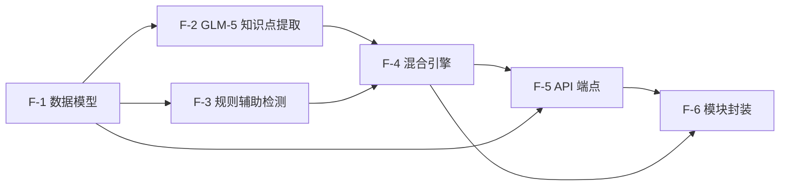

# 功能项：知识点识别与标注

**来源:** [roadmap](../../docs/superpowers/plans/2026-04-29-ai-question-agent.md)
**创建:** 2026-05-01
**状态:** 完成

## 拆解思路

章节结构识别（上轮）已提供 ChapterNode 的 [start_line, end_line] 文本边界——每个章节节点的段落切片就是知识点提取的天然输入窗口。本项聚焦"识别并标注知识点"，不涉及层级关系构建（那是下一项 roadmap leaf）。

拆解线索：先定义知识点的数据模型（KnowledgePoint），再实现按章节窗口分块调用 GLM-5 的核心提取逻辑，然后加入规则辅助（关键术语/定义句式匹配），再合并为混合引擎，最后暴露 API 端点并封装模块。每步完成后系统均可独立启动验证。最简可运行的第一步是 KnowledgePoint Pydantic 模型 + 单章节窗口的 GLM-5 调用，验证"一段章节文本 → 结构化知识点列表"的端到端链路。

## 依赖 DAG

## 功能项

### F-1: 知识点数据模型与文本窗口切分
- [x] **状态:** 已完成
- **生命周期:** 交付
- **目标:** 定义 `KnowledgePoint` Pydantic 模型和 `ChapterWindow` 辅助类型，实现从 ChapterNode 列表和段落数据生成分块文本窗口的工具函数。
- **验证:**
  - `KnowledgePoint(id, name, description, tags, confidence, method, source_line_start, source_line_end)` 模型可实例化并通过 mypy strict 校验
  - `KnowledgeTag(value, category)` 模型存在，category 限定为 Literal["concept", "formula", "procedure", "fact", "principle"]
  - `build_chapter_windows(chapter_nodes, paragraphs, max_chars=3000) -> list[ChapterWindow]` 函数：
    - 输入章节树和段落数据，输出每个章节节点的文本窗口列表
    - 每个窗口含 `chapter_id, chapter_title, text, line_start, line_end`
    - 单章节文本超过 max_chars 时按段落边界自动切分为多个窗口（不截断段落）
    - 空章节（无段落内容）跳过，不生成窗口
  - 空输入返回空列表，不报错
  - 测试覆盖：单章节/多章节/超大章节切分/空章节/空输入
- **依赖:** 无（依赖 chapters/ 的公共 API，但 chapters/ 已完成）
- **代码量:** ~120 行

### F-2: GLM-5 知识点提取核心
- [x] **状态:** 已完成
- **生命周期:** 交付
- **目标:** 复用 chapters/llm.py 的 zai-sdk 集成模式，实现 `extract_knowledge_points_llm(window, client) -> list[KnowledgePoint]`，将单章节文本窗口送入 GLM-5 并解析为结构化知识点。
- **验证:**
  - system prompt 定义知识点识别规则：识别概念定义、公式定理、操作步骤、事实性知识、原理性知识五类；要求输出 JSON schema `{knowledge_points: [{name, description, tags: [{value, category}], source_line_start, source_line_end}]}`
  - `response_format={"type": "json_object"}`，temperature=0.1，max_tokens=3000（知识点比章节更密集，需更大 token 预算）
  - JSON 解析与 Pydantic 校验成功时返回 `list[KnowledgePoint]`，每项 method="llm"，confidence=0.85
  - GLM-5 不可用（API key 缺失/超时/返回空）时返回 None 而非崩溃，记录 warning
  - markdown fence 防御解析逻辑（复用 chapters/llm.py 的 strip 模式）
  - 送入含"牛顿第二定律 F=ma""加速度的定义""匀变速直线运动公式"等内容的物理章节，GLM-5 返回至少 2 个知识点且 tags.category 分布在 concept 和 formula 两类
  - 测试覆盖：有效 JSON 解析/markdown fence/无效 JSON 返回 None/空窗口返回 None/无 API key 返回 None/live API 调用
- **依赖:** F-1（消费 ChapterWindow 和 KnowledgePoint 模型）
- **代码量:** ~160 行

### F-3: 规则辅助知识点检测
- [x] **状态:** 已完成
- **生命周期:** 过度
- **目标:** 基于关键术语模式匹配（"定义：""称为""是指""公式：""定理"等标记词）实现零成本的知识点初筛，为混合引擎提供规则侧输入。此功能覆盖面有限，属于过度项——为 GLM-5 降级场景提供兜底。
- **验证:**
  - `detect_knowledge_points_rule(paragraphs) -> list[KnowledgePoint]` 函数存在
  - 检测"加速度是指速度变化量与发生这一变化所用时间的比值"→ 识别为概念知识点，method="rule"，confidence=0.7
  - 检测"公式：v = v₀ + at"→ 识别为公式知识点，tag.category="formula"
  - 检测"第一步...第二步...第三步..."→ 识别为步骤知识点，tag.category="procedure"
  - 同一段落内多个标记词不重复识别（去重）
  - 纯叙述性文本（无标记词）返回空列表
  - 测试覆盖：概念标记/公式标记/步骤标记/多标记去重/无标记文本/空输入
- **依赖:** F-1（消费 KnowledgePoint 模型）
- **代码量:** ~130 行

### F-4: 知识点混合提取引擎
- [x] **状态:** 已完成
- **生命周期:** 交付
- **目标:** 合并规则检测（F-3）和 GLM-5 提取（F-2）的结果，按 source_line 范围去重、按置信度择优，输出统一的知识点列表。逻辑对标 chapters/hybrid.py 的合并策略。
- **验证:**
  - `extract_knowledge_points_hybrid(windows, paragraphs, llm_client=None) -> dict` 函数存在
  - 返回格式：`{knowledge_points: list[KnowledgePoint], detection_method: "hybrid"|"rule_only"|"llm_only", rule_count, llm_count}`
  - 规则和 LLM 对同一段落范围的知识点重复检测时，保留 confidence 高的，丢弃低的
  - 不同行范围的知识点均保留（规则可能检测到 LLM 漏掉的标记词段落，LLM 可能识别规则无法匹配的隐式知识点）
  - GLM-5 不可用时降级为 rule_only，detection_method="rule_only"
  - 规则也无结果时返回空列表，detection_method="none"，不报错
  - 测试覆盖：hybrid 合并/去重逻辑/LLM 降级/双降级/仅规则有结果/仅 LLM 有结果
- **依赖:** F-2, F-3
- **代码量:** ~120 行

### F-5: API 端点与管线集成
- [x] **状态:** 已完成
- **生命周期:** 交付
- **目标:** 新增 `POST /knowledge` 端点，实现"上传文件 → 结构提取 → 章节识别 → 知识点提取"的完整管线。复用 `/structure` 的章节识别逻辑，在其基础上追加知识点提取步骤。
- **验证:**
  - `POST /knowledge` 上传 PDF/DOCX/TXT 返回完整响应：`{format, chapters: [...], knowledge_points: [{id, name, description, tags, confidence, method, source_line_start, source_line_end, chapter_id}], extraction_stats: {total, rule_count, llm_count, method}}`
  - knowledge_points 中的 chapter_id 关联到对应的章节节点
  - 无章节文档（chapters=null）时，对全文做知识点提取（视为单窗口）
  - 无知识点文档返回 knowledge_points=[] 且 extraction_stats.total=0
  - `/health` 和 `/extract` 和 `/structure` 端点不受影响
  - 新增 Pydantic 响应模型：`KnowledgeTagResponse`, `KnowledgePointResponse`, `KnowledgeExtractionStats`, `KnowledgeResponse`
  - 测试覆盖：PDF 上传/DOCX 上传/TXT 上传/无章节文档/无知识点文档/existing 端点回归
- **依赖:** F-1, F-4
- **代码量:** ~150 行

### F-6: 模块封装与代码清理
- [x] **状态:** 已完成
- **生命周期:** 重构
- **目标:** 将知识点识别相关逻辑抽离到独立的 `knowledge/` 子包，main.py 仅调用公共接口，保持与 chapters/ 一致的模块化模式。
- **验证:**
  - `question_agent/knowledge/` 子包存在，含 `__init__.py`、`models.py`、`llm.py`、`detector.py`、`hybrid.py`、`windows.py`
  - `knowledge/__init__.py` 导出公共接口：`KnowledgePoint`, `KnowledgeTag`, `ChapterWindow`, `build_chapter_windows`, `extract_knowledge_points_hybrid`
  - main.py 中的知识点路由仅调用 `knowledge/` 公共接口，无内联提取逻辑
  - knowledge/ 依赖 chapters/ 的公共 API（ChapterNode），但不依赖 chapters/ 内部实现
  - extractors/ 不依赖 knowledge/，保持单向依赖
  - `/extract`、`/structure`、`/health` 功能完全保留
  - 运行全量测试（105 存量 + 新增知识点测试）全部通过
  - ruff + mypy strict 检查零告警
- **依赖:** F-5
- **代码量:** ~80 行

## 边界与约束

1. **本项仅做知识点识别与标注，不做层级关系构建**——知识点间的父子/前置/关联关系由下一个 roadmap leaf（知识点层级关系构建）负责
2. **KnowledgePoint.id 采用自增序号**——不预设全局唯一 ID 策略，层级关系构建时可能需要重新编号
3. **max_chars=3000 为默认窗口大小**——GLM-4-flash 上下文窗口 128K tokens，3000 中文字符约 1500 tokens，留足 system prompt 空间；如有需要可在 config.py 中暴露配置
4. **规则检测（F-3）为过度项**——标记词匹配对中文理科教材覆盖尚可，对文科教材几乎无效；此功能的目的是提供 GLM-5 降级兜底，不是替代 LLM
5. **tags 字段为列表**——一个知识点可同时标记为 concept 和 principle（如"牛顿定律"既是概念又是原理）

## 风险与边缘情况

| 风险 | 影响 | 缓解策略 |
|------|------|----------|
| GLM-5 对隐式知识点识别率低（教材未明确标注"定义"等标记词时） | 遗漏知识点 | prompt 中强调"识别隐含的知识点，不仅限于有明确标记词的段落"；提供 2-shot 示例 |
| 大章节切分为多窗口后，跨窗口知识点被截断 | 知识点描述不完整 | 切分时在窗口尾部添加 overlap 区（后 1-2 段重复出现在下一窗口头部），提取后按 source_line 去重 |
| GLM-5 幻觉——生成教材中不存在的"知识点" | 产出虚假知识点 | prompt 要求 source_line_start/end 必须对应输入文本的行范围；后处理校验行范围合法性 |
| 同一知识点在不同窗口中被重复提取 | 去重压力增大 | 混合引擎按 (name, source_line 范围重叠度) 去重，重叠度 >50% 视为同一知识点 |
| 规则标记词误检（"是指"出现在非定义语境） | 误标注为知识点 | 规则检测置信度设为 0.7（低于 LLM 的 0.85），混合引擎中低置信度结果可被 LLM 覆盖 |
| 纯文学科教材（语文/英语）标记词极少 | 规则检测几乎无结果 | 已知局限，detection_method 标注为 llm_only 或 none；prompt 模板需适配文学科分析风格 |
