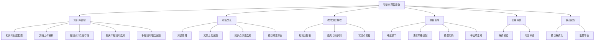

# AI 智能出题智能体 — Spec

**Created:** 2026-04-29
**Last updated:** 2026-05-13
**Status:** DRAFT

## Goal

基于 GLM 系列大模型构建智能出题智能体，以对话为交互形态，利用出版社已有教材内容（章节、例题、练习题设计原理），在无大规模样例题微调的条件下，生成学段契合、知识点匹配、干扰项合理的高质量客观题（选择题）和主观题。

## Target Users

出版社编辑和教研人员 — 需要为教材配套高质量练习题，但缺乏大规模标注样本进行模型微调。

## Key Features

- [ ] **教材知识抽取** — 从教材文本中自动提取知识点层级、能力目标、常错点和考察维度
- [ ] **可控出题** — 支持调节题目难度、语言风格（适配学段）、题型（选择题/主观题），按需生成题目
- [ ] **干扰项逻辑建模** — 模拟学生常见错误思路（概念混淆、计算错误、推理偏差），基于常错点生成合理干扰项
- [ ] **知识库管理** — 创建/管理知识库，上传文档自动解析提取知识点，知识点持久化存储，聊天中选择知识库出题，支持多知识库联合出题
- [ ] **对话式交互** — ChatGPT 风格聊天界面，用户通过对话方式触发出题流程，流式响应；输入框旁可选择知识库
- [ ] **解题负担控制** — 在学段合理范围内约束题目所需的计算量、推理步骤数和文本理解复杂度

## Non-Goals

- 构建完整的在线学习平台或 LMS 系统
- 学生端答题界面与自动批改
- 对 GLM 模型进行微调训练
- 多学科全面覆盖（初期聚焦单一学科验证可行性）
- 题目出版前的最终审核与排版

## Constraints

- 无大规模样例题可用于模型微调，依赖提示工程和知识增强策略
- 基于 GLM 系列大模型（GLM-4 等），需考虑 API 调用成本和响应延迟
- 需适配不同学段的认知水平和语言能力（小学/初中/高中差异显著）
- 教材输入格式多样（PDF/Word/纯文本），需考虑解析鲁棒性

## Unknowns

- 首期聚焦哪个学科（数学的干扰项建模最清晰，但语文/英语的需求量可能更大）
- 教材章节内容的结构化程度差异 — 不同出版社、不同学科的教材格式差异有多大
- GLM 模型在中文教育场景下的出题质量基线 — 零样本 vs 少样本提示的效果差距
- 题目质量控制标准的可操作化 — 如何定义"好题目"，是否需建立人工评审闭环
- 扫描版 PDF（无文本层）的内容提取方案 — 当前仅发 warning，OCR 能力缺失且 toolchain 未为此场景备选
- 章节层级间隙处理策略 — 缺失中间层级时（如只有 level 1 和 level 3），应插入虚拟占位标题还是将下级合并到最近的上级？需产品决策
- LangGraph 与现有出题管线如何编排 — ReAct routing + dispatch_node 已实现（LLM 自主决定是否调工具），但"固定流程编排 vs LLM 自主判断"仍是开放问题，关键词匹配意图检测对长尾表达可能漏判
- 对话中何时触发出题 — dispatch_node 已做意图分类，但主观题意图检测粗糙（关键词匹配），长尾表达可能漏判
- 是否需要多轮对话出题 — 用户能否在对话中逐步细化出题要求（调整难度、指定知识点等）
- Bloom's Taxonomy 认知层级是否替代/增强 basic/intermediate/advanced 难度标签 — 学术研究表明后者对 LLM 出题难度控制效果不稳定，认知层级引导可能更可靠（来源: AAAI 2025, arXiv 2025）
- 主观题 reference_answer 是否需要反向验证步骤 — 当前直接生成，学术共识建议 CoT + 独立验证调用可降低答案幻觉率（来源: EDM 2025）
- 知识库中文档的存储策略 — 原始文件存本地文件系统 vs 对象存储（S3/MinIO），Phase 1 单机可用本地，多用户共享时需迁移
- 多知识库联合出题时的知识点冲突/去重策略 — 不同文档可能提取出重叠知识点，联合出题时如何处理

## Architecture

```mermaid
graph TB
    subgraph Frontend[前端层]
        ChatUI[聊天界面 — 对话交互/文件上传/知识库选择/题目展示]
        KBPage[知识库管理页 — 创建/上传/浏览/删除]
    end
    subgraph ChatAPI[对话层]
        ChatEndpoint[/chat — WebSocket 实时通信]
        ChatNode[chat_node — GLM-5 + bind_tools]
        ToolNode[ToolNode — extract/generate]
    end
    subgraph KBApi[知识库 API]
        KBList[/knowledge-bases — 列表/创建/删除]
        KBDoc[/knowledge-bases/:id/documents — 上传文档]
        KBKp[/knowledge-bases/:id/knowledge-points — 知识点查询]
    end
    subgraph API[出题 API]
        Health[/health]
        Extract[/extract]
        Structure[/structure]
        Knowledge[/knowledge]
        QGen[/questions/generate]
        QFile[/questions/generate/from-file]
        Export[/questions/export]
    end
    subgraph KBStorage[知识库存储]
        KBDB[SQLite — 知识库/文档/知识点元数据]
        KBFiles[本地文件系统 — 原始文档存储]
    end
    subgraph Extractors[提取层]
        PDF[pdf.py — text + structured]
        DOCX[docx.py — text + structured]
        TXT[text.py — text + structured]
    end
    subgraph Chapters[章节识别层]
        Det[detector.py — 编号/样式/字号]
        LLM[llm.py — GLM-5 语义识别]
        Hyb[hybrid.py — 规则优先 + LLM 兜底]
        Tree[tree.py — 平铺→嵌套树]
    end
    subgraph Questions[出题层]
        QPrompts[prompts.py — 类别 prompt]
        QLLM[llm.py — GLM-5 生成]
        QGenMod[generator.py — 批量+失败隔离]
    end
    ChatUI --> ChatEndpoint
    ChatUI --> KBList
    KBPage --> KBList
    KBPage --> KBDoc
    ChatEndpoint --> ChatNode
    ChatNode -->|tool_calls| ToolNode
    ChatNode -->|no tool_calls| END2[END]
    ToolNode -->|result| ChatNode
    ToolNode --> QFile
    ToolNode --> Knowledge
    ToolNode --> QGen
    KBDoc --> Extract
    KBKp --> QGen
    PDF --> Extract
    DOCX --> Extract
    TXT --> Extract
    Extract --> Structure
    Structure --> Det
    Structure --> LLM
    Det --> Hyb
    LLM --> Hyb
    Hyb --> Tree
    Tree --> Structure
    Structure --> Knowledge
    Knowledge --> QGen
    QGen --> QPrompts & QLLM & QGenMod
    KBList --> KBDB
    KBDoc --> KBDB
    KBDoc --> KBFiles
    KBKp --> KBDB
```

## Functional Hierarchy


