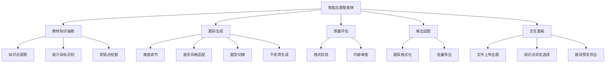

# AI 智能出题智能体 — Spec

**Created:** 2026-04-29
**Last updated:** 2026-05-02
**Status:** DRAFT

## Goal

基于 GLM 系列大模型构建智能出题智能体，利用出版社已有教材内容（章节、例题、练习题设计原理），在无大规模样例题微调的条件下，生成学段契合、知识点匹配、干扰项合理的高质量客观题（选择题）和主观题。

## Target Users

出版社编辑和教研人员 — 需要为教材配套高质量练习题，但缺乏大规模标注样本进行模型微调。

## Key Features

- [ ] **教材知识抽取** — 从教材文本中自动提取知识点层级、能力目标、常错点和考察维度
- [ ] **可控出题** — 支持调节题目难度、语言风格（适配学段）、题型（选择题/主观题），按需生成题目
- [ ] **干扰项逻辑建模** — 模拟学生常见错误思路（概念混淆、计算错误、推理偏差），基于常错点生成合理干扰项
- [ ] **交互式出题面板** — Web 单页应用，支持文件上传触发全链路出题、知识点浏览与选择、题目预览与导出
- [ ] **解题负担控制** — 在学段合理范围内约束题目所需的计算量、推理步骤数和文本理解复杂度

## Non-Goals

- 构建完整的在线学习平台或 LMS 系统
- 学生端答题界面与自动批改
- 对 GLM 模型进行微调训练
- 多学科全面覆盖（初期聚焦单一学科验证可行性）
- 题目出版前的最终审核与排版

## Constraints

- 无大规模样例题可用于模型微调，依赖提示工程和知识增强策略
- 基于 GLM 系列大模型（GLM-4 等），需考虑 API 调用成本和响应延迟
- 需适配不同学段的认知水平和语言能力（小学/初中/高中差异显著）
- 教材输入格式多样（PDF/Word/纯文本），需考虑解析鲁棒性

## Unknowns

- 首期聚焦哪个学科（数学的干扰项建模最清晰，但语文/英语的需求量可能更大）
- 教材章节内容的结构化程度差异 — 不同出版社、不同学科的教材格式差异有多大
- GLM 模型在中文教育场景下的出题质量基线 — 零样本 vs 少样本提示的效果差距
- 题目质量控制标准的可操作化 — 如何定义"好题目"，是否需建立人工评审闭环
- 扫描版 PDF（无文本层）的内容提取方案 — 当前仅发 warning，OCR 能力缺失且 toolchain 未为此场景备选
- 章节层级间隙处理策略 — 缺失中间层级时（如只有 level 1 和 level 3），应插入虚拟占位标题还是将下级合并到最近的上级？需产品决策

## Architecture

```mermaid
graph TB
    subgraph Frontend[前端层]
        UI[单页应用 — 文件上传/知识点选择/题目预览]
    end
    subgraph API
        Health[/health]
        Extract[/extract]
        Structure[/structure]
        Knowledge[/knowledge]
        QGen[/questions/generate]
        QFile[/questions/generate/from-file]
    end
    subgraph Extractors[提取层]
        PDF[pdf.py — text + structured]
        DOCX[docx.py — text + structured]
        TXT[text.py — text + structured]
    end
    subgraph Chapters[章节识别层]
        Det[detector.py — 编号/样式/字号]
        LLM[llm.py — GLM-5 语义识别]
        Hyb[hybrid.py — 规则优先 + LLM 兜底]
        Tree[tree.py — 平铺→嵌套树]
    end
    subgraph Questions[出题层]
        QPrompts[prompts.py — 类别 prompt]
        QLLM[llm.py — GLM-5 生成]
        QGenMod[generator.py — 批量+失败隔离]
    end
    UI --> QFile
    UI --> Knowledge
    UI --> QGen
    PDF --> Extract
    DOCX --> Extract
    TXT --> Extract
    Extract --> Structure
    Structure --> Det
    Structure --> LLM
    Det --> Hyb
    LLM --> Hyb
    Hyb --> Tree
    Tree --> Structure
    Structure --> Knowledge
    Knowledge --> QGen
    QGen --> QPrompts & QLLM & QGenMod
```

## Functional Hierarchy


