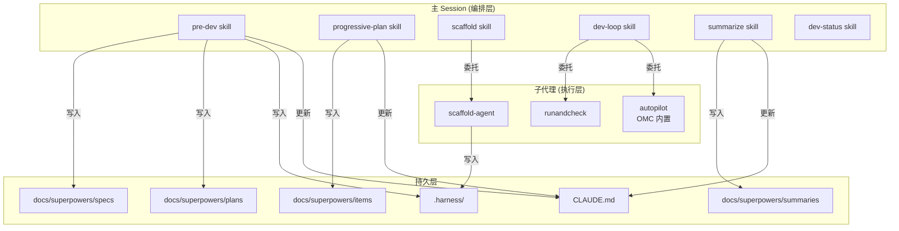
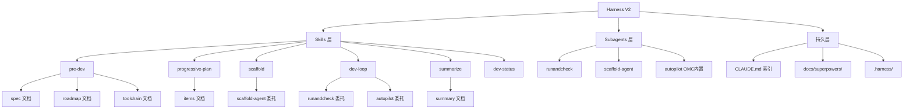

# Harness V2 — Spec

**Created:** 2026-04-30
**Last updated:** 2026-04-30
**Status:** CONFIRMED

## Goal

重构 harness engineering 工作流，明确 skill（编排 + 用户交互）和 subagent（自动化执行）的边界。消除文档生成类 agent（pre-dev-agent、progressive-planner、summarize-agent），将逻辑融合进 skill。将 run 改造为 subagent runandcheck，使 dev-loop 所有实现和验证都在子代理隔离上下文中运行。

## Target Users

使用 Claude Code 进行 harness engineering 的开发者（我）。

## Key Features

- [ ] **Skill/Agent 边界清晰** — skill 负责编排和用户交互，subagent 只做自动化工作
- [ ] **pre-dev 纯 skill** — brainstorming 交互 + 直接写 spec/roadmap/toolchain，移除 pre-dev-agent
- [ ] **progressive-plan 纯 skill** — brainstorming 交互 + 直接写 items doc，移除 progressive-planner
- [ ] **dev-loop 子代理循环** — runandcheck → autopilot → runandcheck 全部在隔离上下文执行
- [ ] **runandcheck 子代理** — 质量门禁 + 边缘测试 + commit，替代原有 run skill

## Non-Goals

- 修改 OMC 内置 autopilot 行为
- 新增其他自定义子代理
- 修改 dev-status skill 逻辑

## Constraints

- subagent 无法直接与用户交互，所有交互必须在 skill 层完成
- Claude Code 当前没有 runandcheck 内置代理，需要自定义实现
- CLAUDE.md 是 /clear 后唯一的上下文来源，索引结构必须自洽

## Unknowns

- runandcheck 子代理的边缘测试生成能力 — 子代理上下文有限，能否有效分析攻击面并编写测试
- autopilot 子代理的修复成功率 — dev-loop 中 autopilot 修复 runandcheck 发现的失败，循环上限需实证调优
- summarize 纯 skill 的上下文收集效率 — 需要读 spec/roadmap/items/git log/diff/pytest，信息量大

## Architecture



## Functional Hierarchy



## Skill 详细职责

### pre-dev (纯 skill，移除 pre-dev-agent)

**输入:** 用户项目描述（一句话或一段话）

**流程:**
1. Brainstorming 交互 — 逐个问题澄清目标/用户/功能/约束
2. 直接写 spec 文档到 `docs/superpowers/specs/YYYY-MM-DD-<name>.md`
3. Gate: 用户确认 spec
4. Brainstorming 交互 — 功能分解确认
5. 直接写 roadmap 文档到 `docs/superpowers/plans/YYYY-MM-DD-<name>.md`
6. Gate: 用户确认 roadmap
7. WebSearch 调研 + 询问用户技术偏好
8. 直接写 toolchain 文档到 `.harness/<name>-toolchain.md`
9. Gate: 用户确认 toolchain
10. 更新 CLAUDE.md — 写入文件索引

### progressive-plan (纯 skill，移除 progressive-planner)

**输入:** roadmap 中下一个 `[ ]` 功能点

**流程:**
1. 读取 spec + roadmap + toolchain
2. 检查代码库当前状态（git log、目录结构、已有 items）
3. Brainstorming 确认目标功能点
4. 直接拆解 5-7 个 F-N（F-1 = 应用骨架，至少 1 个过渡项，收尾重构项）
5. 写 items doc 到 `docs/superpowers/items/YYYY-MM-DD-<name>.md`
6. 更新 roadmap checkbox 并添加 items 链接
7. Gate: 用户确认
8. 更新 CLAUDE.md

### scaffold (skill 编排 + scaffold-agent)

**触发:** 用户手动调用

**流程:**
1. 读取 toolchain.md 获取当前技术栈
2. Skill 提取需求：确认目标 tier（A/B/C）、检查已有配置
3. 委托 scaffold-agent 执行：安装工具、写配置、输出 toolchain.md 验证段
4. Skill 总结反馈：报告哪些工具已安装、哪些失败

### dev-loop (skill 编排，全部子代理)

**输入:** 当前 items doc

**流程:**
1. 读取 items doc，找第一个 `待开始` 的 F-N
2. **runandcheck 子代理** — 基准检查，确保系统当前干净可运行
3. **autopilot 子代理** — 实现当前 F-N
4. **runandcheck 子代理** — 验证 F-N，通过后 commit
5. 更新 items doc 状态
6. 循环 2-5 直到所有 F-N 完成
7. 最后一个 F-N 完成后，runandcheck 最终验证
8. 更新 items doc 头部状态为完成，同步 roadmap checkbox

**关键约束:**
- dev-loop 自身不写代码、不跑测试
- runandcheck 和 autopilot 各自在隔离上下文中运行
- runandcheck 先于 autopilot（不在错误系统上开发）
- 最后一个 F-N 之后必须跑 runandcheck（不让错误溜出去）

### runandcheck (子代理)

**职责:**
1. 读取 .harness/toolchain.md 获取质量门禁命令
2. 执行门禁：lint、format、type check、test
3. 分析当前代码攻击面，编写边缘测试
4. 任一失败 → 生成失败报告（含复现测试），不 commit
5. 全部通过 → 对照 items doc 验证标准，commit

### summarize (纯 skill，移除 summarize-agent)

**流程:**
1. 读取 spec + roadmap + toolchain + items + git log + git diff + pytest 结果
2. WebSearch × 3 收集外部知识
3. 直接写 10-section 总结报告到 `docs/superpowers/summaries/YYYY-MM-DD-summary.md`
4. 更新 state.md 和 iterations 文件
5. 更新 CLAUDE.md

### dev-status (纯 skill，不变)

只读查看 `docs/superpowers/state.md` 和迭代文件。

## CLAUDE.md 格式

```markdown
# Project: <name>

## 当前状态
- Iteration: <N>
- Phase: <current>
- 当前功能项: <F-N name 或 "无">

## 文档
- [Spec](docs/superpowers/specs/<date>-<name>.md) — 一句话描述
- [Roadmap](docs/superpowers/plans/<date>-<name>.md) — 一句话描述
- [Toolchain](.harness/<name>-toolchain.md) — 一句话描述
- [Items](docs/superpowers/items/<date>-<name>.md) — 一句话描述
- [Summary](docs/superpowers/summaries/<date>-summary.md) — 一句话描述

## 质量门禁
<从 toolchain.md 提取的 All Checks 命令>
```

每次 pre-dev / progressive-plan / summarize 完成时更新其中的文件引用。

## 工作流全链路

```
┌─────────────────────────────────────────────────────────┐
│  pre-dev (brainstorming, 直接写 spec/roadmap/toolchain) │
│  progressive-plan (brainstorming, 直接写 items doc)     │
│  更新 CLAUDE.md (文件索引)                               │
│  /clear                                                 │
│  [scaffold — 用户手动触发，搭工具环境]                     │
│  dev-loop (runandcheck → autopilot → runandcheck 循环)   │
│  summarize (直接写总结报告)                               │
│  更新 CLAUDE.md                                          │
│  /clear                                                 │
│  → pre-dev (下一轮迭代)                                   │
└─────────────────────────────────────────────────────────┘
```

## 需删除的文件

| 文件 | 原因 |
|---|---|
| `.claude/agents/pre-dev-agent.md` | 逻辑融合进 pre-dev skill |
| `.claude/agents/progressive-planner.md` | 逻辑融合进 progressive-plan skill |
| `.claude/agents/summarize-agent.md` | 逻辑融合进 summarize skill |
| `.claude/agents/study-agent.md` | 非 harness 核心，study skill 可独立存在 |
| `.claude/skills/run/SKILL.md` | 改为 runandcheck 子代理 |
| `.claude/skills/study/SKILL.md` | 非 harness 核心，超出本次重构范围 |

## 需新建/重写的文件

| 文件 | 说明 |
|---|---|
| `.claude/skills/pre-dev/SKILL.md` | 重写：纯 skill，直接写文档 |
| `.claude/skills/progressive-plan/SKILL.md` | 重写：纯 skill，直接拆解 |
| `.claude/skills/dev-loop/SKILL.md` | 重写：runandcheck + autopilot 子代理循环 |
| `.claude/skills/summarize/SKILL.md` | 重写：纯 skill，直接写报告 |
| `.claude/skills/scaffold/SKILL.md` | 重写：skill 编排 + scaffold-agent |
| `.claude/agents/runandcheck.md` | 新建：质量门禁 + 边缘测试 + commit 子代理 |
| `.claude/agents/scaffold-agent.md` | 微调：确保与 toolchain.md 对接 |
| `CLAUDE.md` | 新建：项目文件索引 |

## 需保持的文件

| 文件 | 说明 |
|---|---|
| `.claude/skills/dev-status/SKILL.md` | 不变 |
| `docs/superpowers/` 下所有现有文档 | 保留 |
| `.harness/` 下所有现有文件 | 保留 |
