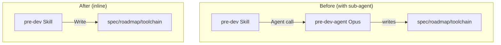
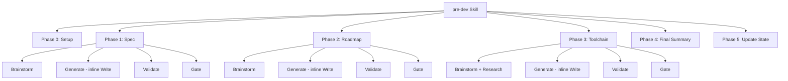

# Refactor pre-dev: Inline Agent into Skill

**Created:** 2026-04-30
**Last updated:** 2026-04-30
**Status:** DRAFT

## Goal

Eliminate the pre-dev-agent sub-agent by merging its document-generation logic directly into the pre-dev skill. All pre-dev functionality is preserved — the only change is the mechanism by which documents are produced.

## Target Users

The pre-dev skill user. No user-facing behavior changes.

## Key Features

- [ ] Replace 3 Agent() calls with direct Write-based document generation
- [ ] Merge pre-dev-agent's output formats, constraints, and examples into the skill
- [ ] Delete agents/pre-dev-agent.md
- [ ] Zero functional changes to the 3-phase flow, brainstorming, validation, gates, or state updates

## Non-Goals

- Changing any pre-dev behavior, flow, or output format
- Refactoring summarize-agent or progressive-planner (same pattern, out of scope)
- Model enforcement — the skill runs on whatever model the user is using

## Constraints

- The skill file grows from ~390 to ~550 lines
- Document generation now shares the same model/context as brainstorming (previously a separate Opus agent)
- Output paths must remain explicit in each Generate step

## Unknowns

- Whether the merged skill will generate documents of equivalent quality without the "fresh eyes" of a separate agent instance
- Whether the larger skill file (~550 lines) impacts skill loading performance

## Architecture

## Functional Hierarchy

## Implementation

### Files Changed

1. **Modify** `.claude/skills/pre-dev/SKILL.md`:
   - Phase 1 Delegate block → Generate block with spec output format, constraints, examples, and output path
   - Phase 2 Delegate block → Generate block with roadmap output format, constraints, examples, and output path
   - Phase 3 Delegate block → Generate block with toolchain output format, constraints, examples, and output path
   - Tool_Usage: `Agent` → `Write`
   - Escalation: "agent delegation fails 3 times" → "generation fails validation 3 times"

2. **Delete** `.claude/agents/pre-dev-agent.md`

### Preserved (No Changes)

- Phase 0: Setup — mode detection (initial vs refine)
- Phase 1-3: Brainstorm — AskUserQuestion flow, no upper limit
- Phase 1-3: Validate — same checklists, re-generate on failure
- Phase 1-3: Gate — same summaries, same handling (continue/change/skip)
- Phase 4: Final Summary — same output format
- Phase 5: Update State — same state.md and iteration file updates
- Gate_Enforcement, Escalation (modified wording only), Progressive_Principle
