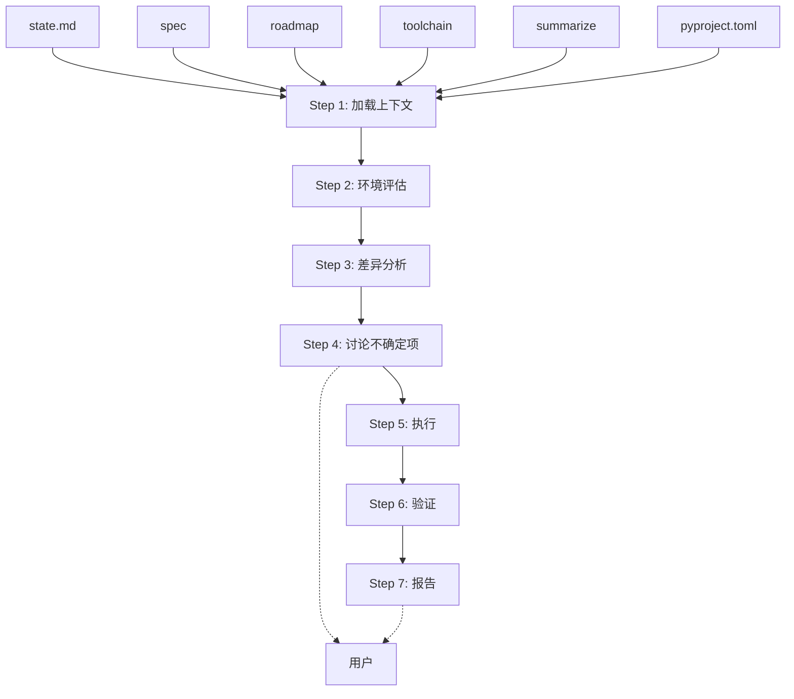

# Scaffold Skill — Design Spec

**Created:** 2026-04-30
**Last updated:** 2026-04-30
**Status:** DRAFT

## Goal

将 scaffold 从 subagent 重构为 skill，使其能够结合 summarize/spec/roadmap/toolchain 等 pre-dev 文档和仓库现有工具，构建可开发和可测试的环境，并在不确定时与用户交互讨论。

## Target Users

使用渐进式开发流水线的开发者 — 需要在每次迭代中快速准备好开发和测试环境。

## Key Features

- [ ] **文档驱动评估** — 从 state.md 加载所有 pre-dev 文档路径，以 toolchain 为期望基准评估当前环境
- [ ] **增量环境搭建** — 对比期望 vs 现状，只处理缺失/不匹配的部分，天然支持渐进式迭代
- [ ] **交互式讨论** — 在工具版本冲突、非标准环境、多方案选择等不确定场景下与用户讨论
- [ ] **开发 + 测试双验证** — 搭建完成后验证开发服务器可启动、测试框架可运行

## Non-Goals

- 不输出 toolchain.md（pre-dev Phase 3 的职责）
- 不做代码质量检查（run skill 的职责）
- 不做项目初始化（不替代 `uv init` 等脚手架命令）
- 不处理生产部署环境

## Constraints

- 作为 skill 运行，可以调用 AskUserQuestion 与用户交互
- 必须可重入 — 多次运行只做增量工作
- 依赖 pre-dev 文档存在（至少 toolchain 存在）
- 保持与现有流水线（pre-dev → progressive-plan → scaffold → dev-loop → summarize）一致

## Unknowns

- 非 Python 项目（TypeScript/Go 等）是否需要支持，还是先聚焦 Python
- 测试基础设施的"完整"标准如何定义 — conftest.py + fixtures + test data 还是更轻量
- 是否需要在 scaffold 阶段启动开发服务器做烟雾测试（端口冲突风险）

## Architecture



## Functional Hierarchy

```mermaid
graph TB
    Root[Scaffold Skill]
    Root --> Ctx[上下文加载]
    Root --> Asm[环境评估]
    Root --> Gap[差异分析]
    Root --> Disc[交互讨论]
    Root --> Exec[执行搭建]
    Root --> Verify[双验证]
    Root --> Report[报告]
    Ctx --> LoadState[加载 state.md]
    Ctx --> LoadDocs[加载 spec/roadmap/toolchain/summarize]
    Ctx --> LoadRepo[加载 pyproject.toml 和已有配置]
    Asm --> CheckTools[检查工具版本]
    Asm --> CheckDeps[检查依赖同步状态]
    Asm --> CheckConfig[检查配置文件完整性]
    Asm --> CheckTest[检查测试基础设施]
    Gap --> Compare[对比期望 vs 现状]
    Gap --> Categorize[缺口分级: 关键/建议/可选]
    Gap --> Plan[生成执行计划]
    Disc --> Conflict[版本冲突处理]
    Disc --> Missing[缺失工具建议]
    Disc --> NonStd[非标准环境检测]
    Exec --> Install[安装缺失工具]
    Exec --> Config[写入配置文件]
    Exec --> TestInfra[搭建测试基础设施]
    Verify --> DevCheck[开发服务器启动验证]
    Verify --> TestCheck[pytest 可用性验证]
```



## Detailed Design

### Step 1: 加载上下文

同时读取以下文件：

| 来源 | 内容 | 用途 |
|------|------|------|
| state.md | spec/roadmap/toolchain 路径、当前迭代 | 定位所有文档 |
| toolchain | 期望的工具列表、版本、All Checks 命令 | 环境期望基准 |
| spec | 项目类型、约束 | 判断项目类型和需求 |
| roadmap | 当前功能范围 | 判断需要的测试基础设施级别 |
| summarize | 经验教训、外部知识 | 避免重复踩坑 |
| pyproject.toml | 已声明依赖 | 与 toolchain 对比验证 |
| 已有配置文件 | .editorconfig, CI 文件等 | 避免重复/冲突配置 |

如果 toolchain 文件不存在 → 报错退出，提示用户先运行 /pre-dev。

### Step 2: 环境评估

逐项检查当前状态：

| 检查项 | 方式 | 输出 |
|--------|------|------|
| 包管理器 | `uv --version` | 版本 / 未安装 |
| 依赖同步 | `uv lock --check` | 同步 / 过期 / 失败 |
| linter | `ruff --version` | 版本 / 未安装 |
| formatter | 检查 pyproject.toml 中 ruff format 配置 | 配置状态 |
| type checker | `mypy --version` | 版本 / 未安装 |
| test runner | `pytest --version` | 版本 / 未安装 |
| test 基础设施 | `ls tests/`, 检查 conftest.py | 存在 / 缺失 / 不完整 |
| dev 启动 | 检查启动脚本或 FastAPI app 入口 | 存在 / 缺失 |
| 已有配置文件 | pyproject.toml 各工具配置段 | 完整 / 部分 / 缺失 |

### Step 3: 差异分析 & 生成计划

对比"当前状态" vs "toolchain 期望"，缺口分三级：

- **关键**：工具未安装或版本不兼容 → 阻塞开发或测试
- **建议**：配置不完整或测试基础设施缺失 → 影响效率但不阻塞
- **可选**：开发辅助（启动脚本、pre-commit 等）→ 按成熟度决定

每项说明 WHAT 和 WHY。根据迭代阶段自动调节范围：

- 早期迭代（1-2）：确保基础工具可用 + 测试能跑
- 中期迭代（3-5）：完善配置 + 测试基础设施（conftest.py、fixtures）
- 后期迭代（6+）：pre-commit hooks、CI 骨架等

### Step 4: 讨论不确定项

只在以下场景使用 AskUserQuestion 询问用户：

- toolchain 要求版本与已安装版本冲突（保留哪个？）
- 发现 toolchain 未覆盖但可能需要的工具（是否添加？）
- 检测到非标准环境（nix shell、devcontainer、docker-only）
- 多个可选方案难以自动判断（如 pytest vs unittest）

不做逐类别向导式询问 — 只在真正不确定时才问。

### Step 5: 执行

按计划顺序执行。报告进度格式：

```
EXECUTING:
  ✓ Step 1: uv sync — 依赖已同步
  ✓ Step 2: ruff config — pyproject.toml 已更新
  ✗ Step 3: pre-commit install — 跳过 (git repo 未初始化)
  ○ Step 4: conftest.py — 已存在，跳过
```

失败项标记并跳过依赖项，继续独立项。

### Step 6: 验证

两件事都必须验证：

- **开发环境**：尝试启动开发服务器（如 `timeout 5 uv run uvicorn question_agent.main:app`），确认无 import 错误
- **测试环境**：运行 `uv run pytest --collect-only`，确认 pytest 可以收集测试

不要求测试全部通过 — 那是 run skill 的职责。这里只验证环境可用。

### Step 7: 报告

```
## Scaffold 完成 — Iteration <N>

设置:
  ✓ uv x.x.x — 已安装
  ✓ ruff x.x.x — 配置已更新
  ✓ pytest x.x — 测试基础设施已创建

跳过:
  ○ pre-commit hooks — 建议后期迭代再添加

验证:
  ✓ 开发服务器可启动 (localhost:8000)
  ✓ pytest 可运行 (42 tests collected)

下一步: /progressive-plan "<下一个功能点>"
```

### 可重入性

Step 2 的评估保证每次运行只做增量。如果已经搭建完成，运行结果是无操作（所有项标记为"已存在，跳过"）。

### 错误处理

- toolchain 不存在 → 报错，提示先运行 /pre-dev
- 工具安装失败 → 标记失败，继续其他项，最后汇总
- 权限不足 → 记录精确的手动修复命令，不使用 sudo
- 无网络 → 跳过 web search，回退到已缓存的知识
- 验证失败 → 标记失败项，给出诊断建议
