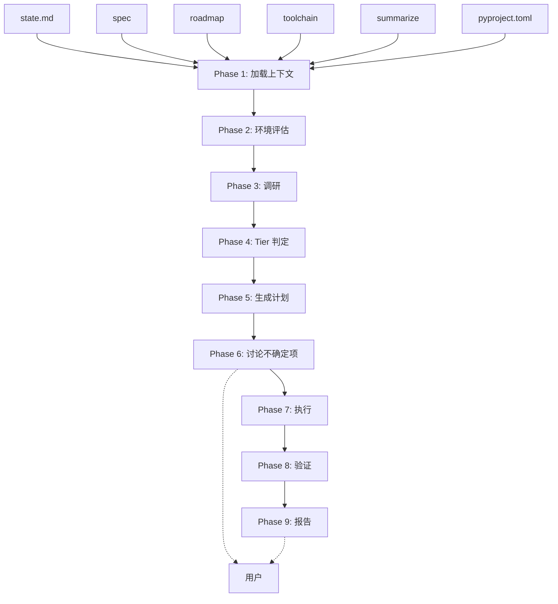

# Scaffold Skill — Design Spec

**Created:** 2026-04-30
**Last updated:** 2026-04-30
**Status:** DRAFT

## Goal

将 scaffold 从 subagent 重构为 skill，使其能够结合 summarize/spec/roadmap/toolchain 等 pre-dev 文档和仓库现有工具，构建可开发和可测试的环境，并在不确定时与用户交互讨论。

## Target Users

使用渐进式开发流水线的开发者 — 需要在每次迭代中快速准备好开发和测试环境。

## Key Features

- [ ] **文档驱动评估** — 从 state.md 加载所有 pre-dev 文档路径，以 toolchain 为期望基准评估当前环境
- [ ] **增量环境搭建** — 对比期望 vs 现状，只处理缺失/不匹配的部分，天然支持渐进式迭代
- [ ] **交互式讨论** — 在工具版本冲突、非标准环境、多方案选择等不确定场景下与用户讨论
- [ ] **开发 + 测试双验证** — 搭建完成后验证开发服务器可启动、测试框架可运行

## Non-Goals

- 不输出 toolchain.md（pre-dev Phase 3 的职责）
- 不做代码质量检查（run skill 的职责）
- 不做项目初始化（不替代 `uv init` 等脚手架命令）
- 不处理生产部署环境

## Constraints

- 作为 skill 运行，可以调用 AskUserQuestion 与用户交互
- 必须可重入 — 多次运行只做增量工作
- 依赖 pre-dev 文档存在（至少 toolchain 存在）
- 保持与现有流水线一致：pre-dev → progressive-plan → scaffold → dev-loop → summarize
- 继承现有 scaffold subagent 中已验证的设计（tier 系统、hard rules、edge cases）

## Unknowns

- 非 Python 项目（TypeScript/Go 等）是否需要支持，还是先聚焦 Python
- 测试基础设施的"完整"标准如何定义 — conftest.py + fixtures + test data 还是更轻量
- 是否需要在 scaffold 阶段启动开发服务器做烟雾测试（端口冲突风险）

## Hard Rules

从现有 scaffold subagent 继承的核心约束：

1. **Never execute before approval** — 任何修改文件系统的操作（安装、写配置）必须先展示 plan 并获得用户批准
2. **Always research — don't trust training data** — 工具生态变化快，对每类工具做 web search 确认当前推荐和活跃状态。无网络时回退到训练知识并标注
3. **Graduate the tier based on context, not defaults** — 基于迭代阶段 + 文档内容 + 仓库现状决定 tier，不硬编码默认值
4. **Every plan item answers WHAT and WHY** — 每项说明做什么、为什么选这个方案
5. **Context before questions** — 先扫描仓库（已有配置、lockfile、CI 文件），再问针对性问题，不要求用户重复已知信息

## Architecture



## Functional Hierarchy

```mermaid
graph TB
    Root[Scaffold Skill]
    Root --> Ctx[上下文加载]
    Root --> Asm[环境评估]
    Root --> Research[调研]
    Root --> Tier[Tier 判定]
    Root --> Plan[生成计划]
    Root --> Disc[交互讨论]
    Root --> Exec[执行搭建]
    Root --> Verify[双验证]
    Root --> Report[报告]
    Ctx --> LoadState[加载 state.md]
    Ctx --> LoadDocs[加载 spec/roadmap/toolchain/summarize]
    Ctx --> LoadRepo[加载 pyproject.toml 和已有配置]
    Asm --> CheckTools[检查工具版本]
    Asm --> CheckDeps[检查依赖同步状态]
    Asm --> CheckConfig[检查配置文件完整性]
    Asm --> CheckTest[检查测试基础设施]
    Research --> WebSearch[web search 确认工具现状]
    Research --> CrossCheck[交叉验证: 推荐工具是否活跃维护]
    Tier --> TierA[A: 核心运行时 — 脚本/实验]
    Tier --> TierB[B: 核心+质量 — 大多数项目]
    Tier --> TierC[C: 完整套件 — 团队/长期项目]
    Plan --> Compare[对比期望 vs 现状]
    Plan --> Categorize[缺口分级: 关键/建议/可选]
    Plan --> GenPlan[生成执行计划]
    Disc --> Conflict[版本冲突处理]
    Disc --> Missing[缺失工具建议]
    Disc --> NonStd[非标准环境检测]
    Exec --> Install[安装缺失工具]
    Exec --> Config[写入配置文件]
    Exec --> TestInfra[搭建测试基础设施]
    Verify --> DevCheck[开发服务器启动验证]
    Verify --> TestCheck[pytest 可用性验证]
```



## Detailed Design

### Phase 1: 加载上下文

同时读取以下文件：

| 来源 | 内容 | 用途 |
|------|------|------|
| state.md | spec/roadmap/toolchain 路径、当前迭代 | 定位所有文档 |
| toolchain | 期望的工具列表、版本、All Checks 命令 | 环境期望基准 |
| spec | 项目类型、约束 | 判断项目类型和需求 |
| roadmap | 当前功能范围 | 判断需要的测试基础设施级别 |
| summarize | 经验教训、外部知识 | 避免重复踩坑（如 K 节某工具不好用的教训） |
| pyproject.toml | 已声明依赖 | 与 toolchain 对比验证 |
| 已有配置文件 | .editorconfig, CI 文件, Makefile 等 | 避免重复/冲突配置 |

如果 toolchain 文件不存在 → 报错退出，提示用户先运行 /pre-dev。

### Phase 2: 环境评估

逐项检查当前状态：

| 检查项 | 方式 | 输出 |
|--------|------|------|
| 包管理器 | `uv --version` | 版本 / 未安装 |
| 依赖同步 | `uv lock --check` | 同步 / 过期 / 失败 |
| linter | `ruff --version` | 版本 / 未安装 |
| formatter | 检查 pyproject.toml 中 ruff format 配置 | 配置状态 |
| type checker | `mypy --version` | 版本 / 未安装 |
| test runner | `pytest --version` | 版本 / 未安装 |
| test 基础设施 | `ls tests/`, 检查 conftest.py, fixtures | 存在 / 缺失 / 不完整 |
| dev 启动 | 检查启动脚本或 app 入口 | 存在 / 缺失 |
| 已有配置文件 | pyproject.toml 各工具配置段 | 完整 / 部分 / 缺失 |

### Phase 3: 调研

对 toolchain 中每个工具类别，web search 确认当前最佳实践：

- 搜索模式：`"best {category} for {language} {current year}"` 或 `"{tool X} vs {tool Y} {current year}"`
- 交叉验证：工具是否活跃维护？是否是社区标准？
- 无网络：跳过，回退到训练知识，在 plan 中标注"可能不是最新推荐"

Gate: 每个类别至少 1-2 个候选方案。

### Phase 4: Tier 判定

基于迭代阶段 + 文档内容 + 仓库现状，推荐 tier：

| Tier | 包含 | 适用场景 |
|------|------|---------|
| A (core runtime) | 语言运行时 + 包管理器 + venv/依赖管理 | 早期迭代（1-2）、一次性脚本、实验项目 |
| B (core + quality) | A + linter + formatter + type checker + test runner | 大多数项目 — 迭代 3-5、solo dev、library、service |
| C (full kit) | B + pre-commit hooks + CI 骨架 + editorconfig | 后期迭代（6+）、团队项目、长期维护代码、开源 |

判定依据：
- 迭代次数（state.md frontmatter.iteration）
- 项目类型（spec.Constraints）
- 已安装工具现状（Phase 2 发现已有什么）
- roadmap 功能范围（越多功能域 → 越需要完整套件）

向用户展示推荐并确认，允许用户切换 tier。

### Phase 5: 生成计划

对比"Phase 2 现状" vs "Phase 4 选定的 tier 期望"，生成缺口列表。每项说明 WHAT 和 WHY：

```
1. 安装 uv (包管理器) — 替代 pip+venv+pip-tools，更快更轻量
2. 添加 ruff 为 dev dependency — lint + format 一个工具替代 flake8+isort+black
3. 添加 pytest 为 dev dependency — 标准 test runner，简单 fixtures，丰富插件生态
4. 更新 pyproject.toml — 配置 ruff rules、pytest 设置、支持的 Python 版本
5. 创建 conftest.py — 共享 fixtures 和 async test 配置
6. 编写 .editorconfig — 统一缩进/字符集（IDE 无关）
```

### Phase 6: 讨论不确定项

只在以下场景使用 AskUserQuestion 询问用户：

- toolchain 要求版本与已安装版本冲突（保留哪个？）
- 调研发现 toolchain 推荐的工具已不推荐/不维护（替换方案？）
- 发现 toolchain 未覆盖但可能需要的工具类别
- 检测到非标准环境（nix shell、devcontainer、docker-only）
- 多个可选方案难以自动判断
- Monorepo 多技术栈 — 问用户想 scaffold 哪部分

不做逐类别向导式询问 — 只在真正不确定时才问。

### Phase 7: 执行

按 plan 顺序执行，报告进度：

```
EXECUTING:
  ✓ Step 1: uv sync — 依赖已同步
  ✓ Step 2: ruff config — pyproject.toml 已更新
  ✗ Step 3: pre-commit install — 跳过 (git repo 未初始化)
  ○ Step 4: conftest.py — 已存在，跳过
```

- 先安装包管理器（如果需要），再安装工具，最后写配置文件
- 每步安装后快速验证工具可用（`ruff --version`、`pytest --version`）
- 失败项标记并跳过依赖项，继续独立项，最后汇总

### Phase 8: 验证

两件事都必须验证：

- **开发环境**：尝试启动开发服务器（如 `timeout 5 uv run uvicorn question_agent.main:app`），确认无 import 错误
- **测试环境**：运行 `uv run pytest --collect-only`，确认 pytest 可以收集测试

不要求测试全部通过 — 那是 run skill 的职责。这里只验证环境可用。

### Phase 9: 报告

```
## Scaffold 完成 — Iteration <N>

Tier: B (core + quality)

设置:
  ✓ uv x.x.x — 已安装
  ✓ ruff x.x.x — 配置已更新
  ✓ pytest x.x — 测试基础设施已创建
  ✓ conftest.py — fixtures 已创建

跳过:
  ○ pre-commit hooks — 建议 Tier C 时再添加

验证:
  ✓ 开发服务器可启动 (localhost:8000)
  ✓ pytest 可运行 (42 tests collected)

下一步: /dev-loop
```

## 可重入性

Phase 2 的评估保证每次运行只做增量。如果所有项已就绪，运行结果是无操作（所有项标记为"已存在，跳过"）。这使得 skill 在每次迭代中都可以安全运行。

## Edge Cases

从现有 scaffold 继承并扩展：

- **无网络** — 跳过 Phase 3 调研，回退到训练知识。在 plan 中标注"推荐可能不是最新"
- **工具已安装** — 通过 `--version` 检测。标记"已配置，跳过"
- **冲突的已有配置** — 明确标记。如 "发现 `.flake8` 配置。ruff 已替代 flake8/isort/black。是否移除旧配置文件？"
- **Monorepo 多技术栈** — 在 Phase 6 问用户要 scaffold 哪部分，不自动假设
- **非标准环境**（nix shell、devcontainer-only、docker-based dev）— Phase 2 检测到后提早在 Phase 6 确认用户意图
- **权限失败** — 记录失败原因和精确的手动修复命令。不使用 `sudo`
- **toolchain 缺失** — 报错退出，提示先运行 /pre-dev
- **验证失败** — 标记失败项，给出诊断建议。不阻塞报告

## 与流水线的关系

```
pre-dev          ← 生成 spec/roadmap/toolchain
    ↓
progressive-plan ← 拆解功能点为 F-N items
    ↓
scaffold         ← 基于文档搭建开发+测试环境 (本 skill)
    ↓
dev-loop         ← 自主开发验证循环
    ↓
summarize        ← 生成迭代总结
    ↓
pre-dev          ← (下一轮迭代)
```
