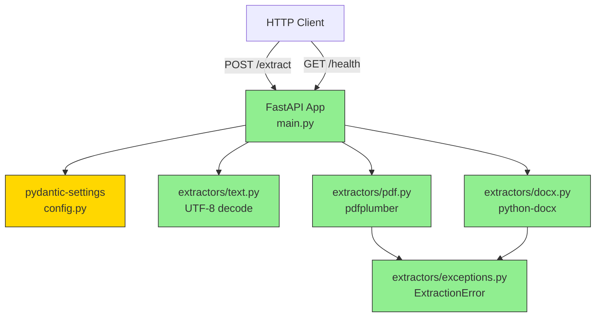

# 总结报告 — 2026-04-30

## A. 本轮完成

本轮实现了 roadmap 中"教材知识抽取 > 教材内容解析 > 多格式文本提取"的全部 7 个功能项（F-1 至 F-7），均按 plan 完成：

- **API 服务骨架:** FastAPI + uvicorn 可运行服务，`/health` 端点，pydantic-settings 配置管理（F-1）
- **三种格式文本提取:** 纯文本（UTF-8 decode + errors="replace" 容错）、PDF（pdfplumber，含 layout 模式、多页拼接、无文本层 warning）、Word .docx（python-docx，含段落/表格/heading 样式标注）（F-2 至 F-4）
- **统一 /extract 端点:** MIME type + 文件扩展名双重检测，自动路由到对应提取器；统一响应结构含 `format`、`text`、`char_count`、`extraction_time_ms`、`page_count`、`warnings` 等字段（F-5 至 F-6）
- **提取器模块化:** 三种提取器拆分为 `extractors/` 子包，共享 `ExtractionError` 异常类；移除旧 per-format 端点（/extract/text, /extract/pdf, /extract/docx）（F-7）
- **测试覆盖:** 36 个测试覆盖健康检查、冒烟测试、三种格式提取、统一端点、边界场景（偏差：测试覆盖超出 plan 验证清单，额外增加 GBK 编码、BOM、二进制伪装文本、空 PDF、空页面、.doc 旧格式拒绝等边界测试）

## B. 代码变更

| 文件 | +行 | -行 | 说明 |
|------|-----|-----|------|
| question_agent/main.py | 128 | 60 | 统一 /extract 端点，移除三个旧 per-format 端点 |
| tests/test_extract_unified.py | 166 | 0 | 统一提取接口测试（新建） |
| tests/test_edge_cases.py | 116 | 0 | 边界场景测试（新建） |
| tests/test_extract_docx.py | 107 | 0 | Word 提取测试（新建） |
| tests/test_extract_pdf.py | 91 | 0 | PDF 提取测试（新建） |
| question_agent/extractors/docx.py | 47 | 0 | Word 提取器模块（新建） |
| question_agent/extractors/pdf.py | 37 | 0 | PDF 提取器模块（新建） |

15 个文件变动，+816/-60 行。核心架构变化：从 per-format 多端点收敛为单一 `/extract` 端点，提取逻辑模块化到 `extractors/` 子包，响应结构通过 Pydantic `ExtractResponse` 模型统一。

## C. 文档现状

| 类型 | 路径 | 状态 |
|------|------|------|
| Spec | docs/superpowers/specs/2026-04-29-ai-question-agent.md | DRAFT — 未反映实际架构 |
| Roadmap | docs/superpowers/plans/2026-04-29-ai-question-agent.md | DRAFT — 建议勾选已完成项 |
| Toolchain | .harness/ai-question-agent-toolchain.md | ACTIVE — 反映当前技术栈 |
| Function Items | docs/superpowers/items/2026-04-29-01-多格式文本提取.md | 完成 — F-1 至 F-7 状态正确 |
| Iteration Log | docs/superpowers/iterations/01-2026-04-29.md | 需更新 — 缺少 dev-loop 阶段记录 |
| State | docs/superpowers/state.md | 需更新 — iteration 1 仍显示 pre-dev 阶段 |
| README | README.md | 需更新 — 仅 1 行头部 |

Roadmap 和 state.md 最需更新：roadmap 应勾选已完成项，state.md 应记录 dev-loop 阶段完成。

## D. 遗留问题

- **章节结构识别未开始:** roadmap 下一个未勾选项，pdfplumber layout 模式和 python-docx heading 样式已为基础数据，但识别逻辑尚未编写
- **zai-sdk (GLM-5) 集成未开始:** pyproject.toml 已声明依赖，config.py 已预留 `glm_api_key`/`glm_model` 字段，但零行调用代码。这是知识抽取、出题、质量评估的前置依赖
- **SQLite 数据库未初始化:** toolchain 声明用于知识点存储和题目缓存，但无 schema 定义和初始化代码
- **扫描版 PDF 无法处理:** 当前仅对无文本层页面发出 warning，OCR 能力缺失
- **首期学科未选定:** spec 标注数学 vs 语文/英语 trade-off 未决，决定延迟到充分调研后
- **GLM-5 出题质量基线未知:** spec 标注为 unknown，尚未进行零样本/少样本 prompt 实验

## E. 外部知识

Web search 本轮不可用。以下来自 pre-dev 阶段 toolchain 调研记录，对下一轮有直接价值：

- **pdfplumber: extract_text(layout=True) 保留排版信息** — 可为章节识别提供位置线索（字号、缩进、间距），而不依赖 GLM-5
- **python-docx: paragraph.style.name 直接暴露 heading 层级** — 对 .docx 格式的章节识别几乎零成本
- **zai-sdk: GLM-5 支持 JSON mode** — 知识点抽取、出题结果可用结构化输出，降低后处理复杂度
- **GLM-5-Flash 免费额度** — 开发期可无成本验证 prompt 效果，建议先用 Flash 跑通链路再切换 Plus 提质量

## F. 下一轮建议

1. **优先实现章节结构识别（规则优先，GLM-5 兜底）** — python-docx heading 样式和 pdfplumber layout 已提供基础数据，先基于规则覆盖 80% 场景（标题样式/字号突变/编号模式），剩余复杂排版交由 GLM-5 语义识别。这是知识点层级提取的前置条件
2. **打通 GLM-5 最小调用链路** — 写一个 smoke test：发送教材片段 + system prompt → 验证 JSON mode 输出可解析。config.py 已预留参数，只需在 question_agent 下新增 llm 模块
3. **初始化 SQLite schema** — 定义知识点表、题目缓存表的基础结构，避免后续知识抽取结果无处落地
4. **建议首期聚焦数学学科** — 数学的干扰项逻辑（概念混淆/计算错误/推理偏差）最清晰、可独立建模，与 spec "初期聚焦单一学科" 一致
5. **更新文档** — state.md、roadmap.md、README.md 均已滞后于实际代码状态，建议下一轮 pre-dev 前同步

## G. 量化统计

| 指标 | 值 |
|------|-----|
| Commits | 7 |
| Files changed | 15 |
| Lines added | +816 |
| Lines deleted | -60 |
| Test files | 5 |
| Test cases | 36 |
| Test pass rate | 100% (36/36, 1.58s) |
| New tests | 36 (all new this iteration) |
| Production modules | 6 (main, config, extractors/__init__, text, pdf, docx, exceptions) |

## H. 架构快照

绿色 = 本轮新建模块，黄色 = 本轮修改模块。当前系统仅含内容摄入层，GLM-5 调用、知识库存储、出题引擎均在下一轮。

## J. 关键决策

**决策 1: 统一 /extract 端点替代三个 per-format 端点**
- 原因: 减少 API 面暴露，格式检测逻辑（MIME + 扩展名双重判断）集中维护，调用方无需记住多个 URL
- 后果: 响应结构通过单一 Pydantic model 统一，不同格式差异通过可选字段（page_count/paragraph_count/table_count/null）体现；旧端点于 commit 5c74499 移除

**决策 2: 提取器模块化到 extractors/ 子包**
- 原因: 各格式提取逻辑可独立演进，共享异常类避免重复定义，后续新增格式只需添加模块并注册到 format dispatch
- 后果: `extractors/__init__.py` 作为公共接口导出 `extract_text`/`extract_pdf`/`extract_docx`/`ExtractionError`；main.py 仅依赖公共接口

**决策 3: 边界测试优先级高于功能扩展**
- 原因: 教材输入格式差异大（不同出版社、学段、编码），需尽早暴露解析鲁棒性问题，避免后续知识点抽取因输入异常而静默失败
- 后果: 36 个测试覆盖了 GBK 编码、BOM、二进制伪装文本、空页面、密码保护 PDF、0 页 PDF、超大文件等场景

## K. 经验教训

**✅ 比预期顺利:**
- pdfplumber 对中文 PDF 提取质量高，`extract_text(layout=True)` 保留段落排版，为章节识别提供良好基础
- python-docx 的 `paragraph.style.name` 直接暴露 Heading 层级，为章节识别省去字号推断的复杂逻辑

**⚠️ 比预期困难:**
- 扫描版 PDF（无文本层）只能发 warning 无法提取内容，OCR 能力缺失是硬约束，且 toolchain 未为此场景做备选方案
- 格式检测需同时信任 MIME 和扩展名（application/octet-stream 不可信），.doc 旧格式需特殊处理并给出友好提示引导用户转换

**💡 意外发现:**
- UTF-8 `errors="replace"` 对非 UTF-8 编码（GBK、二进制）有良好容错性避免崩溃，但替换字符对中文用户不透明——被替换的内容无法被感知
- 函数项拆分为 7 个 F-N 的渐进式策略验证有效：每次交付使系统始终可运行，便于定位引入问题的具体变更点，且每个 F-N 的测试均可独立运行
